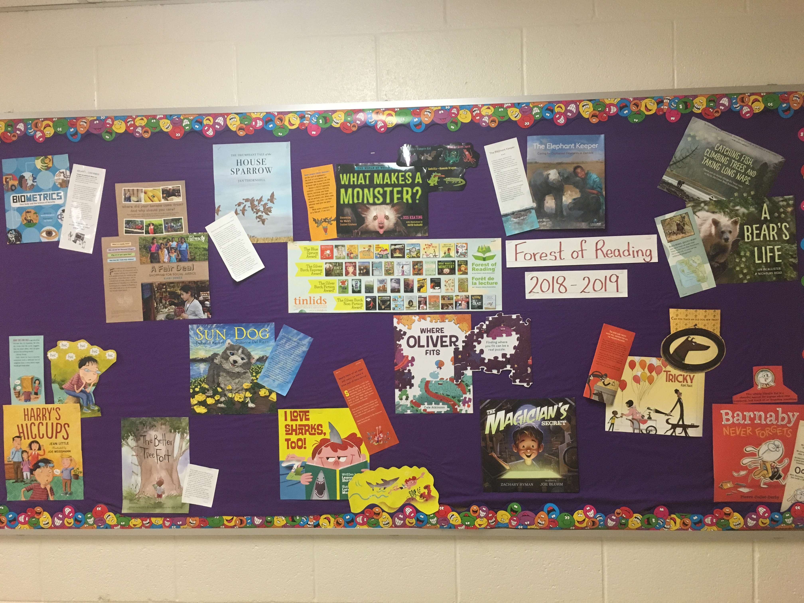
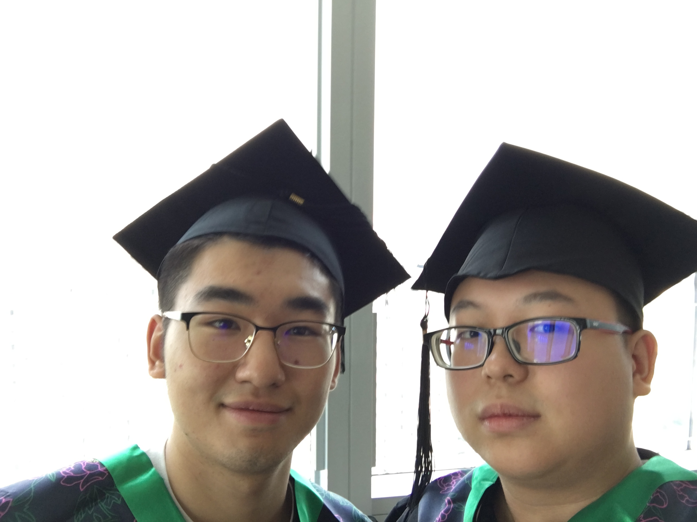
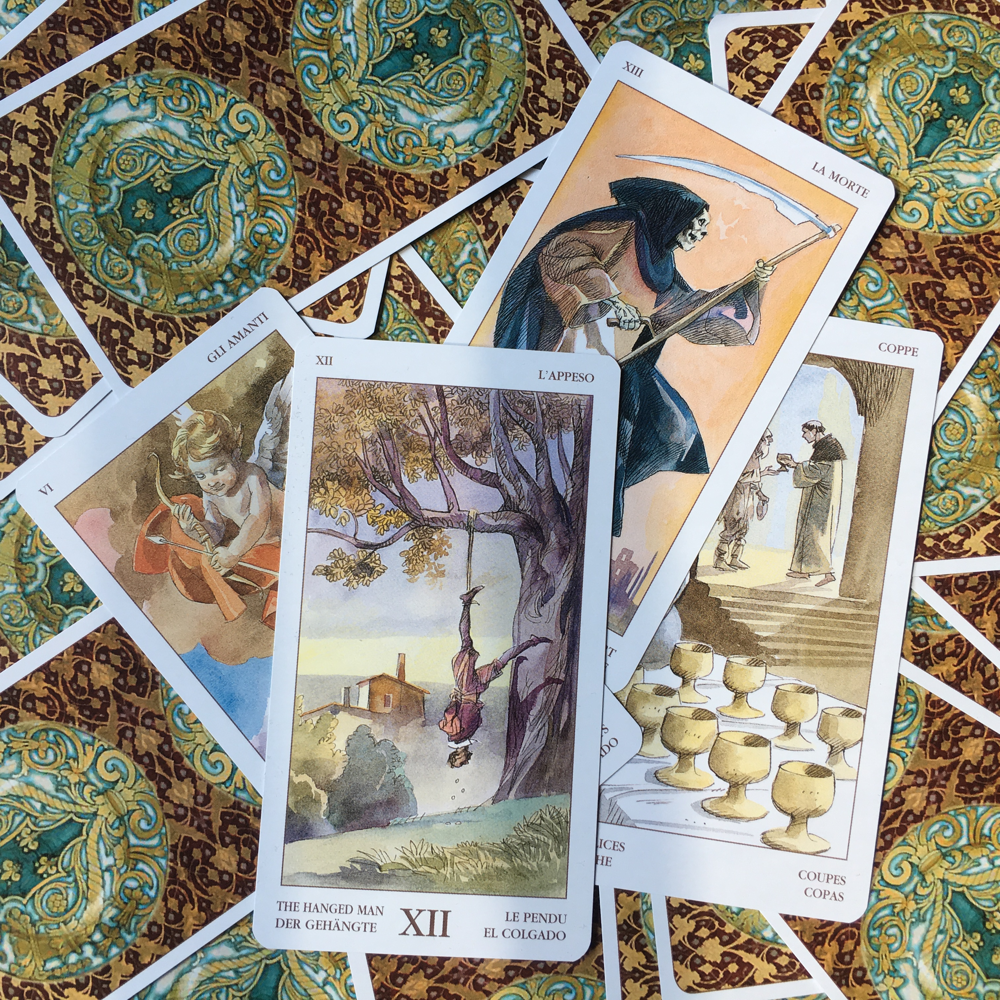

+++
# A Demo section created with the Blank widget.
# Any elements can be added in the body: https://sourcethemes.com/academic/docs/writing-markdown-latex/
# Add more sections by duplicating this file and customizing to your requirements.

widget = "blank"  # See https://sourcethemes.com/academic/docs/page-builder/
headless = true  # This file represents a page section.
active = true # Activate this widget? true/false
weight = 20  # Order that this section will appear.

title = ""
subtitle = ""

[design]
  # Choose how many columns the section has. Valid values: 1 or 2.
  columns = "1"

[design.background]
  # Apply a background color, gradient, or image.
  #   Uncomment (by removing `#`) an option to apply it.
  #   Choose a light or dark text color by setting `text_color_light`.
  #   Any HTML color name or Hex value is valid.

  # Background color.
  # color = "navy"
  
  # Background gradient.
  # gradient_start = "DeepSkyBlue"
  # gradient_end = "SkyBlue"
  
  # Background image.
  # image = ""  # Name of image in `static/img/`.
  # image_darken = 0.6  # Darken the image? Range 0-1 where 0 is transparent and 1 is opaque.

  # Text color (true=light or false=dark).
  text_color_light = false

[design.spacing]
  # Customize the section spacing. Order is top, right, bottom, left.
  padding = ["20px", "0", "20px", "0"]

[advanced]
 # Custom CSS. 
 css_style = ""
 
 # CSS class.
 css_class = ""
+++

I am originally from Guangdong, China and am a student from [University of Toronto](https://www.utoronto.ca/). I specialized in Applied Statistics with a focus on Physics and majored in Economics. Prior to joining in the Applied Statistics Program, I was part of [Education Stream (formerly Ryerson Stream)](https://www.vic.utoronto.ca/future-students/vic-one/), Victoria College. During my first year, I was also a volunteer libarian teacher/STEM teacher in [Clinton Street Junior Public School](https://schoolweb.tdsb.on.ca/clintonstreet).

I also explored my interests in Finance when I received training in [China Life International Financial Academy](https://www.chinalife.com.hk/) and won the first place in the competition. The financial models about optimization consumers' utilities under constraints really intrigued me, so I took more courses about quantitative financial analysis on [DataCamp](https://www.datacamp.com/). While at UofT, I became an avid user of the statistical programming language R and programming language Python. I developed a passion for programming and still on my way to learn more about SQL with database.

I am interested in Tarot and have self-studied for a year about reading Waite Tarot because of my personal interest in the spirituality from the New Age movement. I once doubted that Tarot was merely a probability game, but that fact that I picked up the same card again and again during a few months seemed to be against my original Frequentist's view, suggesting that there was indeed some interconnections among people. Since then, my enthusiasm in this scenario motivates me to learn more about Philosophy, Statistics and the Tarot.

Thank you so much for reading.
