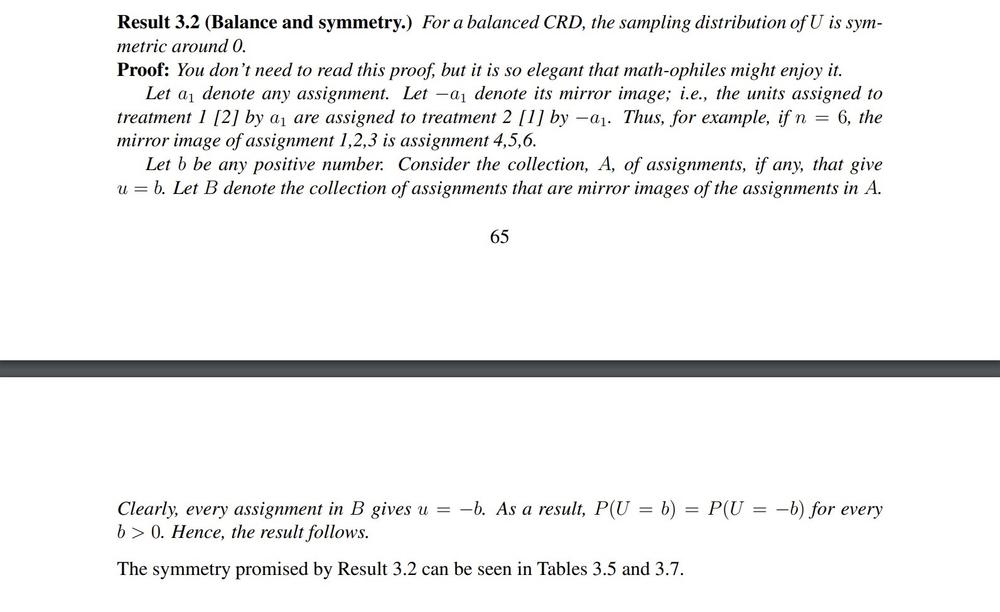
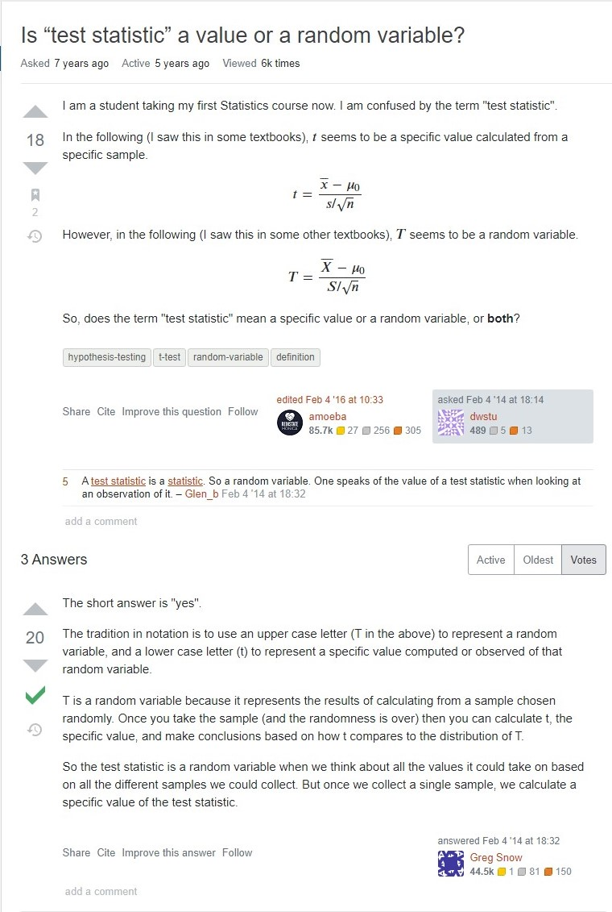

A few days ago, a student asked me about the logic behind the simulated sampling distribution. She was curious about how we could use reshuffling labels + random sampling to obtain a sampling distribution. The logic is related to the Skeptic’s Argument and the consequence of it. Here is the theorem and its elegant proof. 

I am particularly interested in her question because I knew the intuition behind the codes back to my first year at UofT, but I also saw some unbalanced CRDs and the same reshuffling method was used to calculate the sampling distribution. Hence I was confused by the use of the codes.

The symmetric property of an unbalanced CRD turns out to be uncertain in theory, but in many cases we can still see a simulated sampling distribution somewhat symmetric around 0. 

Another question about test statistic appears in one of my students’ writing assignments. In the writing, this student defines the test statistic (mean) as a random variable after calculating an exact number from the sample. Indeed, a test statistic __can be__ a random variable, but it is not when a number is already obtained from the sample. A great answer from an online forum is attached below.

Test statistic is about the sample, but parameter is about the population. If one is thinking about whether a parameter is a random variable or a fixed value, then one may be very interested in the controversy between Bayes and Frequentist. They are fundamentally different approaches to knowledge about data and uncertainty, but they can yield the same result in many situations mathematically. 

This also reminds me of my past experience with statistics. When I learnt probability theories in middle school, we did not really differentiate between these two approaches. We sometimes claimed that one event was more likely to happen because of higher probability, and sometimes interpreted the proportion of heads when flipping the coin for many times as the long-term frequency. 

To wrap up, I use these two examples to show that there can be complicated theories behind some seemingly simple facts. Though this is really beyond the scope of STA130, I still think students can benefit from thinking about these questions. One will get to know more about statistics when one takes a second-year statistics course.

## References

* [Statistic Course Material](http://pages.stat.wisc.edu/~wardrop/courses/371chapter3sum15.pdf) 

* [Stack Exchange Question](https://stats.stackexchange.com/questions/85426/is-test-statistic-a-value-or-a-random-variable)

