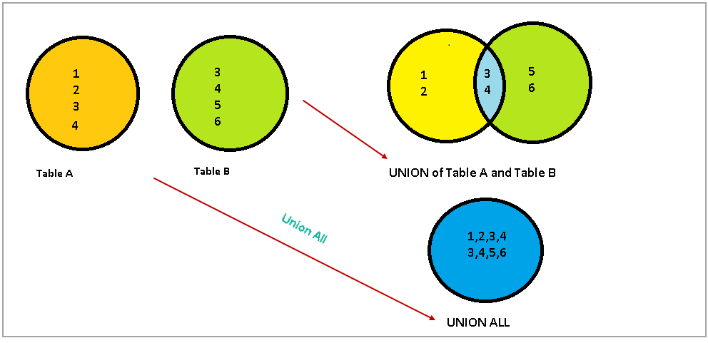
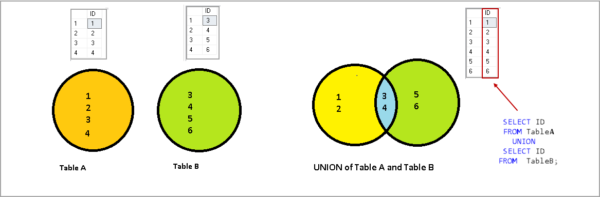

# Working with Sets

- [Working with Sets](#working-with-sets)
  - [Set Theory in Practice](#set-theory-in-practice)
  - [Set Operators](#set-operators)
    - [The UNION Operator](#the-union-operator)
    - [The INTERSECT Operator (Not for MySQL!)](#the-intersect-operator-not-for-mysql)
    - [The EXCEPT Operator (Not for MySQL!)](#the-except-operator-not-for-mysql)
  - [Set Operation Rules](#set-operation-rules)
    - [Sorting Compound Query Results](#sorting-compound-query-results)
      - [Sort](#sort)
      - [Order](#order)

## Set Theory in Practice

* Both data sets must have the **same number of columns**. 
* The **data** **types** of each column across the two data sets must be the **same** (or the server must be able to convert one to the other).

## Set Operators

### The UNION Operator

The `union` and `union all` operators allow you to combine multiple data sets. The difference between the two is that `union` sorts the combined set and *removes duplicates*, whereas `union all` does not. 


https://www.sqlshack.com/sql-union-vs-union-all-in-sql-server/

```sql
SELECT c.first_name, c.last_name 
FROM customer c
WHERE c.first_name LIKE 'J%' AND c.last_name LIKE 'D%'
UNION ALL
SELECT a.first_name, a.last_name 
FROM actor a
WHERE a.first_name LIKE 'J%' AND a.last_name LIKE 'D%'; 
```

| first_name | last_name |
| :--------- | --------: |
| JENNIFER   |     DAVIS |
| JENNIFER   |     DAVIS |
| JUDY       |      DEAN |
| JODIE      | DEGENERES |
| JULIANNE   |     DENCH |

**R** codes: 

```r
library(dplyr)
union_all(df1,df2)
```

where as `UNION` removes duplicate Jennifer Davis.


https://www.sqlshack.com/sql-union-vs-union-all-in-sql-server/

```sql
SELECT c.first_name, c.last_name 
FROM customer c
WHERE c.first_name LIKE 'J%' AND c.last_name LIKE 'D%'
UNION 
SELECT a.first_name, a.last_name 
FROM actor a
WHERE a.first_name LIKE 'J%' AND a.last_name LIKE 'D%'; 
```

| first_name | last_name |
| :--------- | --------: |
| JENNIFER   |     DAVIS |
| JUDY       |      DEAN |
| JODIE      | DEGENERES |
| JULIANNE   |     DENCH |

**R** codes: 

```r
library(dplyr)
union(df1,df2)
```

### The INTERSECT Operator (Not for MySQL!)

```sql
SELECT c.first_name, c.last_name 
FROM customer c
WHERE c.first_name LIKE 'J%' AND c.last_name LIKE 'D%'
INTERSECT 
SELECT a.first_name, a.last_name 
FROM actor a
WHERE a.first_name LIKE 'J%' AND a.last_name LIKE 'D%'; 
```

| first_name | last_name |
| :--------- | --------: |
| JENNIFER   |     DAVIS |

**R** codes: 

```r
library(dplyr)
intersect(df1,df2)
```

### The EXCEPT Operator (Not for MySQL!)

```sql
SELECT c.first_name, c.last_name 
FROM customer c
WHERE c.first_name LIKE 'J%' AND c.last_name LIKE 'D%'
EXCEPT 
SELECT a.first_name, a.last_name 
FROM actor a
WHERE a.first_name LIKE 'J%' AND a.last_name LIKE 'D%'; 
```

| first_name | last_name |
| :--------- | --------: |
| JUDY       |      DEAN |
| JODIE      | DEGENERES |
| JULIANNE   |     DENCH |

**R** codes: 

```r
library(dplyr)
setdiff(df1,df2)
```

*Set A *

| actor_id |
| :------: |
|    10    |
|    11    |
|    12    |
|    10    |
|    10    |

*Set B*
| actor_id |
| :------: |
|    10    |
|    10    |

The operation` A except B` yields the following:

| actor_id |
| :------: |
|    11    |
|    12    |

The operation` A except all B` yields the following:

| actor_id |
| :------: |
|    10    |
|    11    |
|    12    |

The difference between the two operations is that except removes all occurrences of duplicate data from set A, whereas except all removes only one occurrence of duplicate data from set A *for every occurrence* in set B.

## Set Operation Rules 

The following sections outline some rules that you must follow when working with compound queries.

### Sorting Compound Query Results

#### Sort

```sql
SELECT a.first_name fname, a.last_name lname /*aliases can be helpful*/ 
FROM actor a
WHERE a.first_name LIKE 'J%' AND a.last_name LIKE 'D%'  UNION ALL
SELECT c.first_name, c.last_name  
FROM customer c
WHERE c.first_name LIKE 'J%' AND c.last_name LIKE 'D%'  ORDER BY lname, fname; 
```

#### Order
In general, compound queries containing three or more queries are evaluated in order from top to bottom. Except for:

* The ANSI SQL specification calls for the intersect operator to have precedence over the other set operators.
* You may dictate the order in which queries are combined by enclosing multiple queries in parentheses.

NOT FOR MySQL:

You can also wrap adjoining queries in parentheses to override the default top-to-bottom processing of compound queries.

```sql
SELECT a.first_name, a.last_name FROM actor a
WHERE a.first_name LIKE 'J%' AND a.last_name LIKE 'D%' UNION (SELECT a.first_name, a.last_name FROM actor a
WHERE a.first_name LIKE 'M%' AND a.last_name LIKE 'T%' UNION ALL
SELECT c.first_name, c.last_name FROM customer c
WHERE c.first_name LIKE 'J%' AND c.last_name LIKE 'D%'
)
```