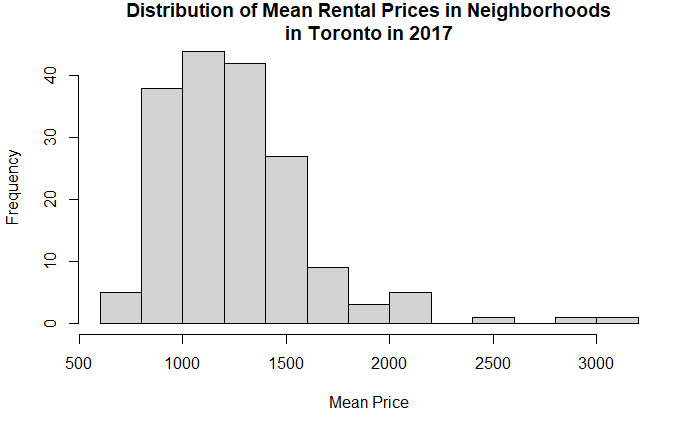
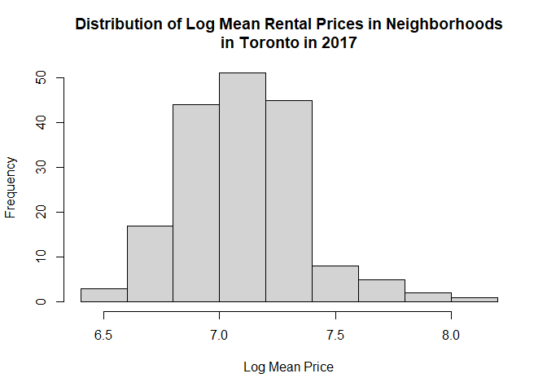
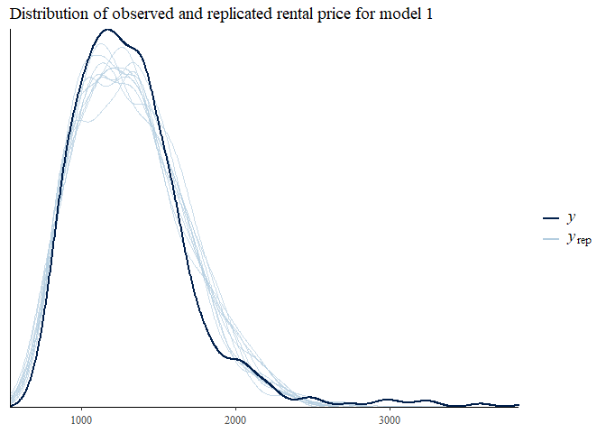
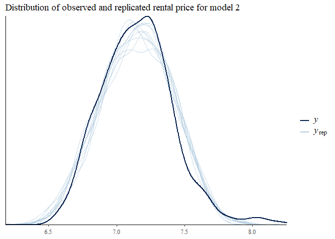
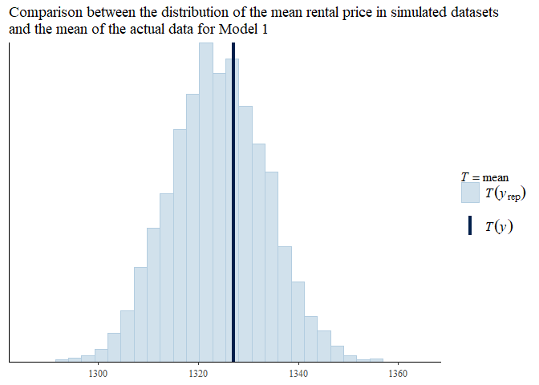
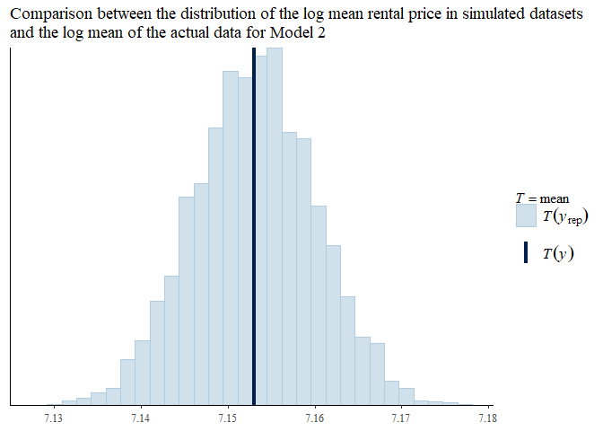
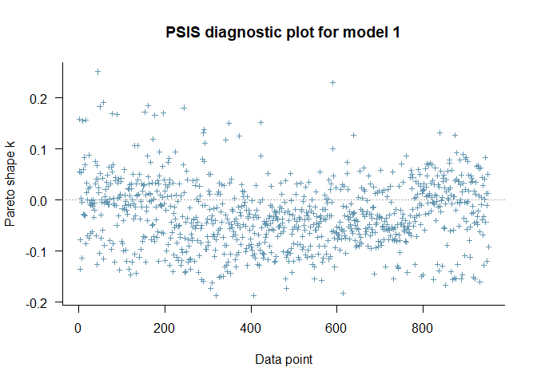
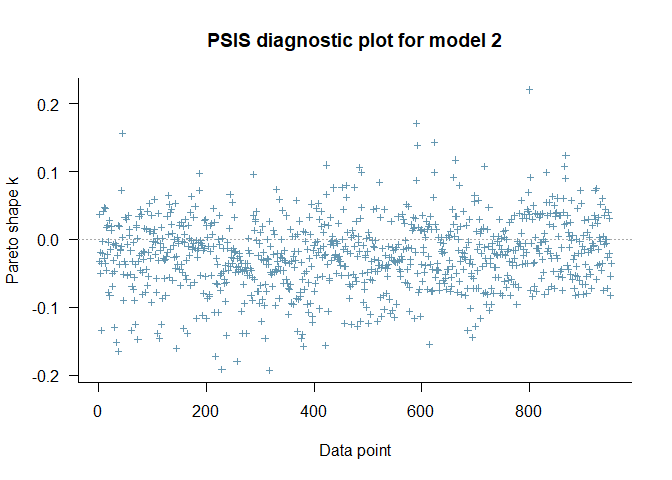

## Data Preparation

According to a research in the distribution of housing price in Tokyo (OHNISHI, MIZUNO, SHIMIZU & WATANABE, 2011), the housing price follows a lognormal distribution. Therefore we would like to examine if an exponential model works for the mean rental price $\mu_{ij}$ of type j at year i in Toronto with two predictors (year and unit size). Data were adapted from Canada Mortgage and Housing Corporation (2021). For copyrights reasons, the dataset will not be attached on GitHub. The link to the dataset can be found under Bibliography Section. An overview of the data is provided below. 


```r
# Data Wrangling
library(tidyverse)
# Bayes Models
library(brms)
library(tidybayes)
library(bayesplot)
library(loo)
# Prior libraries
library(extraDistr)
library(cmdstanr)
library(posterior)
# html widgets
library(kableExtra)
```


```r
head(df_bay)
```

```
## # A tibble: 6 x 4
##   neighbourhood                year_temp unit_size   rent
##   <chr>                            <dbl> <chr>      <dbl>
## 1 Banbury-Don Mills/York Mills         0 0 bedroom    881
## 2 Banbury-Don Mills/York Mills         0 1 bedroom   1097
## 3 Banbury-Don Mills/York Mills         0 2 bedrooms  1253
## 4 Banbury-Don Mills/York Mills         0 3 bedrooms  1565
## 5 Bathurst Manor                       0 0 bedroom    797
## 6 Bathurst Manor                       0 1 bedroom   1101
```

Note: Year 0 represents year 2016 and year 4 is 2020. 


```r
df_bay_2016 = df_bay %>%
  filter(year_temp==1) %>%
  select(rent)

hist(df_bay_2016$rent, main='Distribution of Mean Rental Prices in Neighborhoods in Toronto in 2017', xlab='Mean Price') 
```

<!-- -->

```r
hist(log(df_bay_2016$rent),  main='Distribution of Log Mean Rental Prices in Neighborhoods\nin Toronto in 2017', xlab='Log Mean Price')
```

<!-- -->

## Two Matematically Equivalent Approaches

We consider the following equivalent approaches and test if both models agree with each other.

We are going to consider the following two approaches (with brms in R):

Approach 1: $\mu_{ij}\sim lognormal((b_{0j}+\beta_0)+(b_{1j}+\beta_1)x_i,\sigma^2)$ (i.e.family=lognormal())

Approach 2: $log(\mu_{ij})\sim N((b_{0j}+\beta_0)+(b_{1j}+\beta_1)x_i,\sigma^2)$ 

where

$b_{0j}$: Random intercept due to j type of unit size;

$\beta_0$: Baseline intercept, which may have no practical meaning;

$x_i$: Variable year i, ranging from 2011 to 2020;

$b_{1j}$: Random slope due to j type of unit size;

$\beta_1$: Coefficient of variable year;

$\sigma^2$: Actual variation in rental price.

## Priors

Weakly informative priors are chosen based on our belief in the baseline price of a studio at the intercept, which is around 700 Canadian dollars per month, in Toronto. Moreover, we expect the unit size has small effects on the intercept (normal distribution is chosen for this reason). At the same time, we also want to ensure that we do not miss the possibility of large parameters with Cauchy distribution as priors: 

$\beta_0\sim N(700,100)$

$b_{0j}\sim N(0,1)$

$b_{1j}\sim N(0,{\tau_1}^2 )$

$\beta_1\sim N(0,{\tau_2}^2 )$

${\tau_1}^2,{\tau_2}^2,\sigma\sim Cauchy(0,1)$

$Cov(b_{0j},b_{1j})\sim Cholesky LKJ Correlation Distribution(1.5)$

Note: Prior Predictive Check is not the main focus of this project, so it is omitted to save space for the model comparison below. One should, however, conduct prior predictive check to be more rigorous.

## Model 1 Estimates


```r
priors <- c(prior(normal(700, 100), class = Intercept),
                       prior(normal(0, 1), class = b),
                       prior(cauchy(0, 1), class = sd),
                       prior(cauchy(0, 1), class = sigma),
                       prior(lkj_corr_cholesky(1.5), class = cor))
# priors <- c(prior(normal(0,1), class = Intercept),
#             prior(cauchy(0,0.5), class = sd))
if (!file.exists("models/bayes_mod1.rds")){
   mod_1 <- brm(rent ~ (1 + year_temp | unit_size   ) + year_temp ,
               data = df_bay,
               prior = priors,
               family=lognormal(), 
               warmup = 1000, # burn-in
               iter = 5000, # number of iterations
               chains = 2,  # number of MCMC chains
               control = list(adapt_delta = 0.95)) 
   saveRDS(mod_1, file= "models/bayes_mod1.rds")
} else {
  mod_1 <- readRDS("models/bayes_mod1.rds")
}

fixef(mod_1)  %>%
  kable(booktabs = T, caption = "Fixed Effects for Model 1") %>%
  kable_styling(latex_options = c("HOLD_position", "scale_down"))
```

<table class="table" style="margin-left: auto; margin-right: auto;">
<caption>Fixed Effects for Model 1</caption>
 <thead>
  <tr>
   <th style="text-align:left;">   </th>
   <th style="text-align:right;"> Estimate </th>
   <th style="text-align:right;"> Est.Error </th>
   <th style="text-align:right;"> Q2.5 </th>
   <th style="text-align:right;"> Q97.5 </th>
  </tr>
 </thead>
<tbody>
  <tr>
   <td style="text-align:left;"> Intercept </td>
   <td style="text-align:right;"> 7.052757 </td>
   <td style="text-align:right;"> 0.2196256 </td>
   <td style="text-align:right;"> 6.5951566 </td>
   <td style="text-align:right;"> 7.5166879 </td>
  </tr>
  <tr>
   <td style="text-align:left;"> year_temp </td>
   <td style="text-align:right;"> 0.054498 </td>
   <td style="text-align:right;"> 0.0087226 </td>
   <td style="text-align:right;"> 0.0406854 </td>
   <td style="text-align:right;"> 0.0670868 </td>
  </tr>
</tbody>
</table>

```r
data.frame(ranef(mod_1))  %>%
  kable(booktabs = T, caption = "Random Effects for Model 1") %>%
  kable_styling(latex_options = c("HOLD_position", "scale_down"))
```

<table class="table" style="margin-left: auto; margin-right: auto;">
<caption>Random Effects for Model 1</caption>
 <thead>
  <tr>
   <th style="text-align:left;">   </th>
   <th style="text-align:right;"> unit_size.Estimate.Intercept </th>
   <th style="text-align:right;"> unit_size.Est.Error.Intercept </th>
   <th style="text-align:right;"> unit_size.Q2.5.Intercept </th>
   <th style="text-align:right;"> unit_size.Q97.5.Intercept </th>
   <th style="text-align:right;"> unit_size.Estimate.year_temp </th>
   <th style="text-align:right;"> unit_size.Est.Error.year_temp </th>
   <th style="text-align:right;"> unit_size.Q2.5.year_temp </th>
   <th style="text-align:right;"> unit_size.Q97.5.year_temp </th>
  </tr>
 </thead>
<tbody>
  <tr>
   <td style="text-align:left;"> 0 bedroom </td>
   <td style="text-align:right;"> -0.2945081 </td>
   <td style="text-align:right;"> 0.2198822 </td>
   <td style="text-align:right;"> -0.7599386 </td>
   <td style="text-align:right;"> 0.1641069 </td>
   <td style="text-align:right;"> 0.0028919 </td>
   <td style="text-align:right;"> 0.0091980 </td>
   <td style="text-align:right;"> -0.0093780 </td>
   <td style="text-align:right;"> 0.0213398 </td>
  </tr>
  <tr>
   <td style="text-align:left;"> 1 bedroom </td>
   <td style="text-align:right;"> -0.0838120 </td>
   <td style="text-align:right;"> 0.2196423 </td>
   <td style="text-align:right;"> -0.5421174 </td>
   <td style="text-align:right;"> 0.3796284 </td>
   <td style="text-align:right;"> 0.0012612 </td>
   <td style="text-align:right;"> 0.0086730 </td>
   <td style="text-align:right;"> -0.0118502 </td>
   <td style="text-align:right;"> 0.0167562 </td>
  </tr>
  <tr>
   <td style="text-align:left;"> 2 bedrooms </td>
   <td style="text-align:right;"> 0.0867104 </td>
   <td style="text-align:right;"> 0.2198136 </td>
   <td style="text-align:right;"> -0.3782345 </td>
   <td style="text-align:right;"> 0.5462856 </td>
   <td style="text-align:right;"> -0.0003455 </td>
   <td style="text-align:right;"> 0.0088410 </td>
   <td style="text-align:right;"> -0.0151367 </td>
   <td style="text-align:right;"> 0.0140831 </td>
  </tr>
  <tr>
   <td style="text-align:left;"> 3 bedrooms </td>
   <td style="text-align:right;"> 0.2633750 </td>
   <td style="text-align:right;"> 0.2195523 </td>
   <td style="text-align:right;"> -0.1990381 </td>
   <td style="text-align:right;"> 0.7254240 </td>
   <td style="text-align:right;"> -0.0016846 </td>
   <td style="text-align:right;"> 0.0087438 </td>
   <td style="text-align:right;"> -0.0178807 </td>
   <td style="text-align:right;"> 0.0113221 </td>
  </tr>
</tbody>
</table>

## Model 2 Estimates


```r
# priors <- c(prior(normal(0,1), class = Intercept),
#             prior(cauchy(0,0.5), class = sd))
if (!file.exists("models/bayes_mod2.rds")){
  mod_2 <- brm(log(rent) ~ (1 + year_temp | unit_size   ) + year_temp ,
                          data = df_bay,
                          prior = priors,
                          warmup = 1000, # burn-in
                          iter = 5000, # number of iterations
                          chains = 2,  # number of MCMC chains
                          control = list(adapt_delta = 0.95)) 

  saveRDS(mod_2, file= "models/bayes_mod2.rds")
  
} else {
  mod_2 <- readRDS("models/bayes_mod2.rds")
}

fixef(mod_2)  %>%
  kable(booktabs = T, caption = "Fixed Effects for Model 2") %>%
  kable_styling(latex_options = c("HOLD_position", "scale_down"))
```

<table class="table" style="margin-left: auto; margin-right: auto;">
<caption>Fixed Effects for Model 2</caption>
 <thead>
  <tr>
   <th style="text-align:left;">   </th>
   <th style="text-align:right;"> Estimate </th>
   <th style="text-align:right;"> Est.Error </th>
   <th style="text-align:right;"> Q2.5 </th>
   <th style="text-align:right;"> Q97.5 </th>
  </tr>
 </thead>
<tbody>
  <tr>
   <td style="text-align:left;"> Intercept </td>
   <td style="text-align:right;"> 7.0518325 </td>
   <td style="text-align:right;"> 0.2324473 </td>
   <td style="text-align:right;"> 6.5815863 </td>
   <td style="text-align:right;"> 7.5796947 </td>
  </tr>
  <tr>
   <td style="text-align:left;"> year_temp </td>
   <td style="text-align:right;"> 0.0549225 </td>
   <td style="text-align:right;"> 0.0075329 </td>
   <td style="text-align:right;"> 0.0401083 </td>
   <td style="text-align:right;"> 0.0683509 </td>
  </tr>
</tbody>
</table>

```r
data.frame(ranef(mod_2))  %>%
  kable(booktabs = T, caption = "Random Effects for Model 2") %>%
  kable_styling(latex_options = c("HOLD_position", "scale_down"))
```

<table class="table" style="margin-left: auto; margin-right: auto;">
<caption>Random Effects for Model 2</caption>
 <thead>
  <tr>
   <th style="text-align:left;">   </th>
   <th style="text-align:right;"> unit_size.Estimate.Intercept </th>
   <th style="text-align:right;"> unit_size.Est.Error.Intercept </th>
   <th style="text-align:right;"> unit_size.Q2.5.Intercept </th>
   <th style="text-align:right;"> unit_size.Q97.5.Intercept </th>
   <th style="text-align:right;"> unit_size.Estimate.year_temp </th>
   <th style="text-align:right;"> unit_size.Est.Error.year_temp </th>
   <th style="text-align:right;"> unit_size.Q2.5.year_temp </th>
   <th style="text-align:right;"> unit_size.Q97.5.year_temp </th>
  </tr>
 </thead>
<tbody>
  <tr>
   <td style="text-align:left;"> 0 bedroom </td>
   <td style="text-align:right;"> -0.2939128 </td>
   <td style="text-align:right;"> 0.2329494 </td>
   <td style="text-align:right;"> -0.8206667 </td>
   <td style="text-align:right;"> 0.1726338 </td>
   <td style="text-align:right;"> 0.0026946 </td>
   <td style="text-align:right;"> 0.0079855 </td>
   <td style="text-align:right;"> -0.0107282 </td>
   <td style="text-align:right;"> 0.0205602 </td>
  </tr>
  <tr>
   <td style="text-align:left;"> 1 bedroom </td>
   <td style="text-align:right;"> -0.0830413 </td>
   <td style="text-align:right;"> 0.2324192 </td>
   <td style="text-align:right;"> -0.6096193 </td>
   <td style="text-align:right;"> 0.3857650 </td>
   <td style="text-align:right;"> 0.0009799 </td>
   <td style="text-align:right;"> 0.0076378 </td>
   <td style="text-align:right;"> -0.0127195 </td>
   <td style="text-align:right;"> 0.0172185 </td>
  </tr>
  <tr>
   <td style="text-align:left;"> 2 bedrooms </td>
   <td style="text-align:right;"> 0.0882536 </td>
   <td style="text-align:right;"> 0.2321475 </td>
   <td style="text-align:right;"> -0.4375356 </td>
   <td style="text-align:right;"> 0.5553330 </td>
   <td style="text-align:right;"> -0.0009177 </td>
   <td style="text-align:right;"> 0.0076263 </td>
   <td style="text-align:right;"> -0.0167288 </td>
   <td style="text-align:right;"> 0.0138163 </td>
  </tr>
  <tr>
   <td style="text-align:left;"> 3 bedrooms </td>
   <td style="text-align:right;"> 0.2643750 </td>
   <td style="text-align:right;"> 0.2323713 </td>
   <td style="text-align:right;"> -0.2665589 </td>
   <td style="text-align:right;"> 0.7340761 </td>
   <td style="text-align:right;"> -0.0022045 </td>
   <td style="text-align:right;"> 0.0079285 </td>
   <td style="text-align:right;"> -0.0200957 </td>
   <td style="text-align:right;"> 0.0117391 </td>
  </tr>
</tbody>
</table>

Key Findings for both models:

* Both models yield similar estimates for both fixed effects and random effects.

* The rental price increases by around 5.6% each year on average, higher than the inflation rate 3.6 % in Canada;

* The baseline price for 3-bedroom apartment is 73% higher than a Studio, so a hierarchy model is necessary;

* The slope does not vary much for each room type, so a random intercept model may be sufficient for analysis.

## Posterior Predictive Check (Density)


```r
pp_check(mod_1) + labs(title="Distribution of observed and replicated rental price for model 1")
```

```
## Using 10 posterior samples for ppc type 'dens_overlay' by default.
```

<!-- -->

```r
pp_check(mod_2) + labs(title="Distribution of observed and replicated rental price for model 2")
```

```
## Using 10 posterior samples for ppc type 'dens_overlay' by default.
```

<!-- -->

Both models are reasonable from the comparison above.

## Posterior Predictive Check (Test Statistic)


```r
pp_check(mod_1, type = "stat", stat = 'mean', nsamples = 5000) + labs(title="Comparison between the distribution of the mean rental price in simulated datasets\nand the mean of the actual data for Model 1")
```

```
## `stat_bin()` using `bins = 30`. Pick better value with `binwidth`.
```

<!-- -->

```r
pp_check(mod_2, type = "stat", stat = 'mean', nsamples = 5000) + labs(title="Comparison between the distribution of the log mean rental price in simulated datasets\nand the log mean of the actual data for Model 2")
```

```
## `stat_bin()` using `bins = 30`. Pick better value with `binwidth`.
```

<!-- -->

Both models are reasonable from the comparison above.

## Leave-one-out Cross-validation(LOO-CV)


```r
loo1b <- loo(mod_1, save_psis = TRUE)

loo2b <- loo(mod_2, save_psis = TRUE)


plot(loo1b, main = "PSIS diagnostic plot for model 1")
```

<!-- -->

```r
plot(loo2b, main = "PSIS diagnostic plot for model 2")
```

<!-- -->

Pareto k estimates, which give an indication of how ‘influential’ each point is. The higher the value of k, the more influential the point is. Points with K over 0.5 are not good, fortunately there are not influential points for both models.

## Conclusion

Though the models have subtle difference in actual results, RStan produces the estimates for both models fairly. One may want to explore further about rental prices with more predictors and gather more data to validate the model.


## Bibliography

Canada Mortgage and Housing Corporation.(2021).Toronto — Historical Average Rents by Bedroom Type.https://www03.cmhc-schl.gc.ca/hmip-pimh/en/TableMapChart/Table?TableId=2.2.11&GeographyId=2270&GeographyTypeId=3&DisplayAs=Table&GeograghyName=Toronto 
